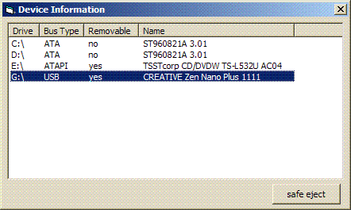



## device information \(USB detection\)

### Description

This reads the bus type of all drives associated with a drive letter.

This way you can safely detect removable USB devices.

It also has a feature to safely eject a device from the system (taken from activevb.de) and automatically displays arrival and removal of new devices.

Should work on NT/2k/XP.
 
### More Info
 

             |
---                |---
**Submitted On**   |2007-02-18 17:21:06
**By**             |[Arne Elster](https://github.com/Planet-Source-Code/PSCIndex/blob/master/ByAuthor/arne-elster.md)
**Level**          |Intermediate
**User Rating**    |4.9 (83 globes from 17 users)
**Compatibility**  |VB 6\.0
**Category**       |[Miscellaneous](https://github.com/Planet-Source-Code/PSCIndex/blob/master/ByCategory/miscellaneous__1-1.md)
**World**          |[Visual Basic](https://github.com/Planet-Source-Code/PSCIndex/blob/master/ByWorld/visual-basic.md)
**Archive File**   |[device\_inf2048792192007\.zip](https://github.com/Planet-Source-Code/arne-elster-device-information-usb-detection__1-67914/archive/master.zip)

